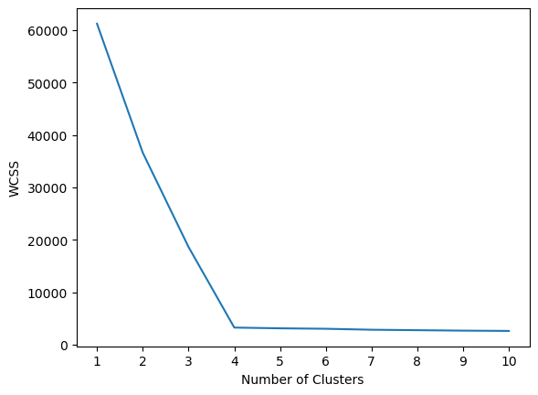
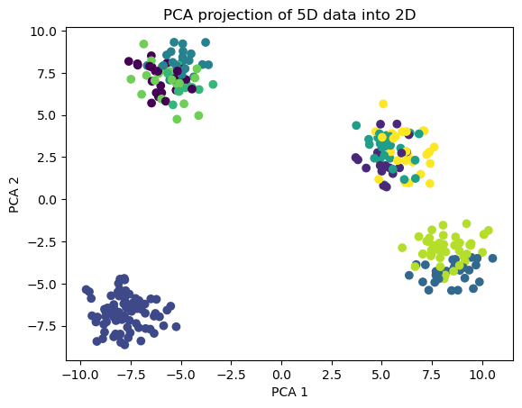
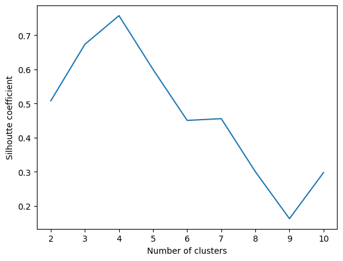

# PCA and K-Means Clustering

This project demonstrates the application of PCA for dimensionality reduction and K-Means clustering for unsupervised learning.

## Steps Implemented:

1. **Data Generation**:
   - Synthetic dataset created using `make_blobs` with 5 features and 4 centers.

2. **Dimensionality Reduction**:
   - Applied PCA to reduce the dataset from 5D to 2D for visualization.

3. **Clustering with K-Means**:
   - Elbow Method used to determine the optimal number of clusters (WCSS).
   - K-Means clustering performed on the training dataset.

4. **Cluster Visualization**:
   - Visualized clusters in 2D space using PCA-transformed data.

5. **Cluster Performance Evaluation**:
   - Used Silhouette Score to evaluate clustering quality.

## Key Libraries Used:
- `matplotlib`: For data visualization.
- `sklearn`: For PCA, K-Means, and evaluation metrics.
- `kneed`: For detecting the elbow point in WCSS.

## How to Run:
1. Ensure the required libraries are installed: `matplotlib`, `scikit-learn`, `kneed`, and `pandas`.
2. Execute the Python script sequentially.
3. View visualizations for PCA projections, elbow plot, and clustering results.

## Outputs:
- PCA projections of 5D data into 2D.
- Elbow plot to select optimal `k` for K-Means.
- Silhouette coefficients for clustering quality assessment.

